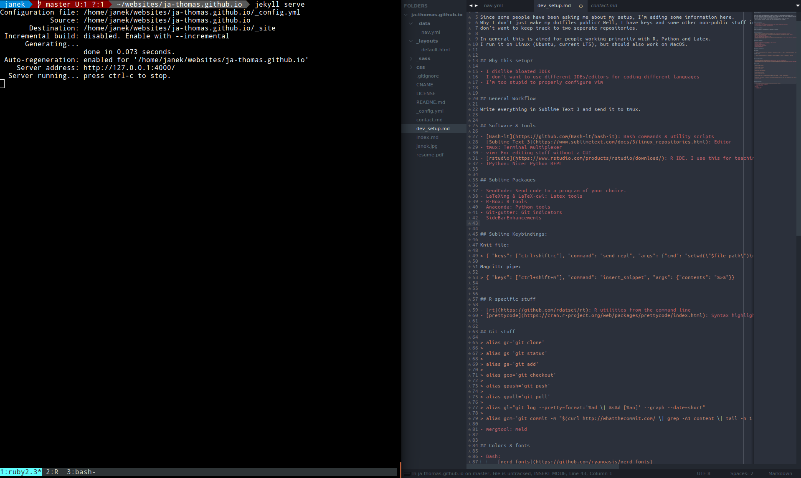

Since some people have been asking me about my setup, I'm adding some information here.
Why I don't just make my dotfiles public? Well, I have keys and some other non-public stuff in there and I
don't want to keep track to two seperate repositories.

In general this is aimed for people working primarily with R, Python and Latex.
I run it on Linux (Ubuntu, current LTS), but should also work on MacOS.

---

## Why this setup?

- I dislike bloated IDEs
- I don't want to use different IDEs/editors for coding different languages
- I'm too stupid to properly configure vim

## General Workflow

Write everything in Sublime Text 3 and send it to tmux.

## Software & Tools

- [Bash-it](https://github.com/Bash-it/bash-it): Bash commands & utility scripts
- [Sublime Text 3](https://www.sublimetext.com/docs/3/linux_repositories.html): Editor
- tmux: Terminal multiplexer
- vim: For editing stuff without a GUI
- [rstudio](https://www.rstudio.com/products/rstudio/download/): R IDE. I use this for teaching
- IPython: Nicer Python REPL
- [ack](https://beyondgrep.com/): Fast search in code base

## Sublime Packages

- SendCode: Send code to a program of your choice.
- LaTeXing & LaTeX-cwl: Latex tools
- R-Box: R tools
- Anaconda: Python tools
- rsub: Edit files over ssh
- Git-gutter: Git indicators
- SideBarEnhancements

## Sublime Keybindings:

Knit file:

> { "keys": ["ctrl+shift+c"], "command": "send_repl", "args": {"cmd": "setwd(\"$file_path\")\nknitr::knit(\"$file\", output=\"$file_base_name.tex\")\ntools::texi2dvi(\"$file_base_name.tex\", pdf = TRUE)"}}

Magrittr pipe:

> { "keys": ["ctrl+shift+m"], "command": "insert_snippet", "args": {"contents": "%>%"}}

## R specific stuff

- [rt](https://github.com/rdatsci/rt): R utilities from the command line
- [prettycode](https://cran.r-project.org/web/packages/prettycode/index.html): Syntax highlighting in the terminal

## Git stuff

> alias gc='git clone'
>
> alias gs='git status'
>
> alias ga='git add'
>
> alias gco='git checkout'
>
> alias gpush='git push'
>
> alias gpull='git pull'
>
> alias gl="git log --pretty=format:'%ad \| %s%d [%an]' --graph --date=short"
>
> alias gcm='git commit -m "$(curl http://whatthecommit.com/ \| grep -A1 content \| tail -n 1 \| cut -c 4-)"'
>
> alias gfuck='ga . && gcm && gpush'
>
> alias ginfo='git remote show origin'
>
> gclone() {
>   remote=${2:-github.com}
>   git clone git@$remote:$1.git
> }

- mergtool: meld

## Colors & fonts

- Bash:
    - [nerd-fonts](https://github.com/ryanoasis/nerd-fonts)
    - powerline (bash-it theme)
    - tmux: colour87
- Sublime:
    - Ubuntu Mono
    - Spacegray

## Example

